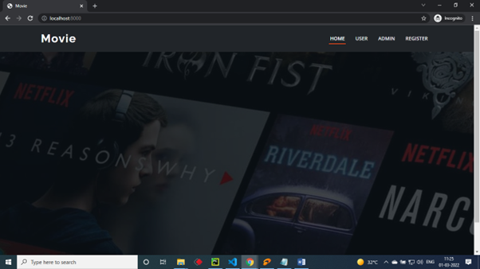

# 🎥 Hybrid movie recommendation using collaborative and content-based filtering

A hybrid movie recommendation web application built using Python and Django that integrates **Collaborative Filtering**, **Content-Based Filtering**, and **Sentiment Analysis** to deliver personalized movie recommendations based on user preferences and reviews.

---

## 📌 Project Overview

Traditional recommendation systems rely solely on user history or item similarity. This project addresses those limitations by building a **hybrid recommender** that:
- Recommends movies based on what similar users watched (Collaborative Filtering)
- Recommends movies based on content similarity (Content-Based Filtering)
- Analyzes user sentiment from reviews (Positive / Negative / Neutral) to refine recommendations

---

## 🚀 Features

- 🔐 User Registration & Login (Admin-activated accounts)
- 🎥 Movie dataset upload and management
- 🤖 ML-powered recommendation engine (KNN + Collaborative + Content-Based)
- 💬 Sentiment analysis on user reviews (Positive / Negative / Neutral)
- 📊 Admin dashboard with algorithm accuracy and results
- 🌐 Web interface built with Django

---

## 🛠️ Tech Stack

| Layer | Technology |
|---|---|
| Backend | Python, Django |
| Machine Learning | Scikit-learn, KNN, Collaborative Filtering, Content-Based Filtering |
| NLP | Sentiment Analysis (Positive / Negative / Neutral classification) |
| Data Processing | Pandas, NumPy |
| Model Serialization | Pickle |
| Frontend | HTML, CSS, JavaScript |
| IDE | VS Code, Jupyter Notebook |

---

## 🧠 Machine Learning Modules

### 1. Data Preprocessing
- Removes noise and handles missing values
- Converts data to float format for algorithm execution
- Splits data into **60% training / 40% testing**

### 2. Collaborative Filtering
- Finds users with similar movie preferences
- Recommends movies liked by similar users

### 3. Content-Based Filtering
- Recommends movies similar in genre, cast, and attributes
- Based on item feature similarity

### 4. Sentiment Analysis
- Users submit reviews after watching
- ML classifier predicts sentiment: Positive / Negative / Neutral
- Sentiment feedback is used to refine future recommendations

### 5. KNN Classifier
- K-Nearest Neighbours used to support recommendation and prediction workflows
- Results and model outputs displayed through the admin dashboard

---

## 👥 User Roles

**User:**
- Register with email and mobile
- Login after admin activation
- Upload movie dataset
- View collaborative and content-based recommendations
- Submit reviews and view sentiment predictions

**Admin:**
- Activate registered users
- View all dataset records
- Monitor algorithm accuracy and results

---

## 📷 Application Preview

### Home Page


### Admin Dashboard


### User Dashboard


### Content-Based Recommendation


---

## ⚙️ How to Run Locally

```bash
# Clone the repository
git clone https://github.com/vaddi-karthik/Movie-Recommender-system.git
cd Movie-Recommender-system

# Install dependencies
pip install -r requirements.txt

# Run the Django server
python manage.py runserver

# Open in browser
http://127.0.0.1:8000
```

---

## 📁 Project Structure

```
Movie-Recommender-system/
│
├── manage.py               # Django entry point
├── requirements.txt        # Dependencies
├── db.sqlite3             # Database
│
├── recommender/           # Main app
│   ├── models.py          # Database models
│   ├── views.py           # Application logic
│   ├── urls.py            # URL routing
│   └── templates/         # HTML templates
│
├── ml_models/             # Trained ML models
│   ├── dt.pkl             # Decision Tree model
│   ├── myfun1.pkl         # Sentiment classifier
│   └── run.pkl            # Supporting model
│
└── static/                # CSS, JS files
```

---

## 📊 Results

- Combined collaborative filtering, content-based filtering, and sentiment analysis to generate personalized movie recommendations
- Integrated sentiment analysis to classify user reviews into Positive, Negative, and Neutral categories
- Built an admin interface to monitor recommendation outputs and application behavior

---

## 🔮 Future Enhancements

- Integration with live movie APIs (TMDB, IMDB)
- Deep learning models for improved accuracy
- Mobile-responsive UI
- Real-time collaborative filtering with larger datasets

---

## 👨‍💻 Author

**Karthik Vaddi**  
B.Tech in Artificial Intelligence & Machine Learning  
📧 vaddikarthik2004@gmail.com  
🔗 [LinkedIn](https://www.linkedin.com/in/karthik-vaddi-581193268/)  
🐙 [GitHub](https://github.com/vaddi-karthik)
